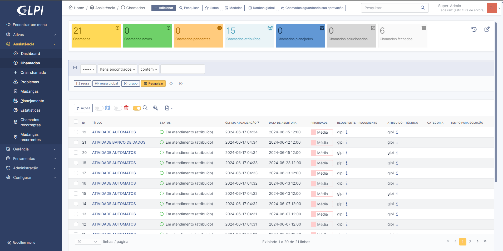
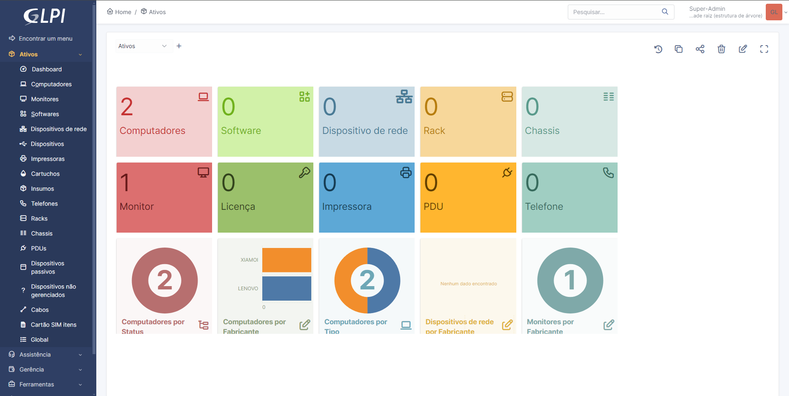

# Introdução ao GLPI

## Instalação do GLPI

Como já vimos, o **GLPI** é um sistema de gerenciamento de TI. Nele você pode adicionar ativos, chamados, criação de usuários, etc. A seguir, as formas de instalação do **GLPI** são:   
 
### Algumas formas de instalar
 - [XAMPP](https://www.apachefriends.org/pt_br/index.html) 
 - [WSL](https://learn.microsoft.com/pt-br/windows/wsl/) (Subsistema Windows para Linux)
 - [VitualBox](https://www.virtualbox.org/) (Máquina virtual)

## Instalação e configuração

### Primeiro Passo

Instale o XAMPP.

| Versão: 8.0.30 / PHP 8.0.30

Como o XAMPP instalado, baixe uma pasta do [GLPI](https://glpi-project.org/pt-br/baixar/), **a versão mais recente estável** GLPI 10.0.15.

### Segundo Passo

Extraia a pasta do GLPI. Após extrair a pasta, adicione-a ao XAMPP. Localize a pasta htdocs, bote a pasta que voceê recortou dentro dela, e agora o **XAMPP** vai conseguir usar as funcionalidades do GLPI. 

### Terceiro Passo

Garanta a porta certa no XAMPP, caso tenha o MySql instalado antes do XAMPP, provavelmente os dois estarão para a porta 3306, dito isso, mude no XAMPP APACHE E MYSQL, em ACTIONS-CONFIG e troque a porta 3306 para 3307. Do mesmo jeito no bloco de ntoas do my.ini, trocando a porta 3306 para  a nova. Faça esse mesmo processo no pasta do Module do Apache, no arquivo php.ini, e troque tudo para a porta 3307.

### Quarto Passo

Agora temos tudo que precisamos para utilizar o **GLPI**. Primeiro clique em start tanto no **Apache** e no **mySQL**, após isso,  no seu navegador principal cole `URL: http://localhost/glpi`, direcionando ao **GLPI**.

#### Primeiro Passo GLPI

Defina a linguagem de preferência.

#### Segundo Passo GLPI

Com a licença, continue.

#### Terceiro Passo GLPI

Com todos os passos anteriores feitos, continue.

#### Quarto Passo

Provavelmente alguns presets ainda não estão prontos. Veja abaixo:

Gd e intl ausentes, logo, adicione-os no Module Apache, retirando o ";" deles.Descomente eles e salva o arquivo no bloco de notas. Atualize o navegador e continue.

#### Quinto Passo

Agora você irar criar uma conexão com  o banco de dados para armazenar seus arquivos.

| Enderço do servidor: localhost  | Usuário SQL: root   | Senha (sem senha)

Após isso, continue.

#### Sexto Passo

Dê nome ao banco de dados e continue.

#### Sétimo Passo

Continue caso ele peça confirmação para criação imediata do banco de dados.

#### Oitavo Passo

Confirmação sobre coleta de dados, continue.

#### Nona Passo

Ao perguntar se vai utilizar o GLPI, aperte na opção de uso do GLPI.

#### Decimo Passo 

Agora é só entrar no sistema e configurar de acordo com o que você deseja.

| Nome do utilizador: glpi  | Palavra passe: glpi 

**Utilize o que está acima para entrar como administrador no seu sistema GLPI**

### Quinto Passo

Meu projeto após adicionar máquinas e chamados:

